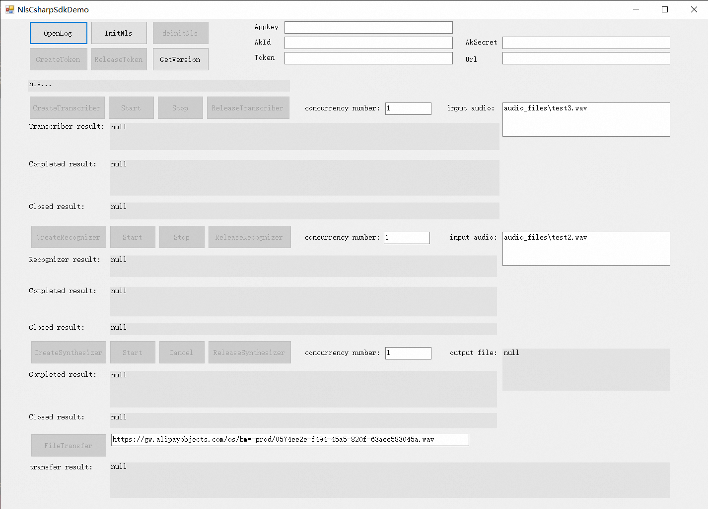

# 阿里智能语音交互

欢迎使用阿里智能语音交互（C++ SDK）。

C++ SDK 提供一句话识别、实时语音识别、语音合成等服务。可应用于客服、法院智能问答等多个场景。  


## 前提条件

在使用 C++ SDK 前，确保您已经：

* 注册了阿里云账号并获取您的Access Key ID 和 Secret。

* 开通智能语音交互服务

* 创建项目

* 获取访问令牌（Access Token)

* Linux下请安装CMake 3.0及以上, GCC 4.8.5 或以上版本。目前验证且顺利编译运行的GCC版本有: 4.8.5、5.5.0、8.4.0

详细说明请参考:[智能语音交互接入](https://help.aliyun.com/document_detail/72138.html)  


## 如何使用 C++ SDK

接入前请仔细阅读C++ SDK3.1.x文档：https://help.aliyun.com/product/30413.html

特殊说明：当前版本C++SDK3.1.x，相较于3.0，接口sendAudio和各接口返回值有改动，具体请看接口头文件中接口说明。  

### 接口调用流程演示
   


### Linux平台编译及说明：
编译指令：  
> ./scripts/build_linux.sh                  默认增量编译，生成Debug版本  
> ./scripts/build_linux.sh all debug        全量编译，生成Debug版本  
> ./scripts/build_linux.sh incr debug       增量编译，生成Debug版本  
> ./scripts/build_linux.sh all release      全量编译，生成Release版本  
> ./scripts/build_linux.sh incr release     增量编译，生成Release版本  
> ./scripts/build_linux.sh all debug 1      全量编译，生成Debug版本，支持C++11

生成物NlsSdk3.X_LINUX 目录说明:  
NlsSdk3.X_LINUX  
│── bin  
│   │── daDemo         对话Demo binary文件  
│   │── gtDemo         token生成Demo binary文件  
│   │── ftDemo         录音文件识别Demo binary文件  
│   │── srDemo         一句话识别Demo binary文件  
│   │── stDemo         实时识别Demo binary文件  
│   └── syDemo         语音合成Demo binary文件  
│── demo  
│   │── build_linux_demo.sh           一键编译当前Demo  
│   │── generateTokenDemo.cpp         token生成Demo源码  
│   │── dialogAssistantDemo.cpp       对话Demo源码  
│   │── speechRecognizerDemo.cpp      一句话识别Demo源码  
│   │── speechSynthesizerDemo.cpp     语音合成Demo源码  
│   │── speechTranscriberDemo.cpp     实时识别Demo源码  
│   └── fileTransferDemo.cpp          录音文件转写Demo源码  
│   │── resource            测试资源（测试音频文件）  
│   │   └── audio  
│   │       ├── test0.wav  
│   │       ├── test1.wav  
│   │       ├── test2.wav  
│   │       └── test3.wav  
│── include                 接口头文件  
│   │── iNlsRequest.h  
│   │── nlsClient.h  
│   │── nlsEvent.h  
│   │── nlsGlobal.h  
│   │── nlsToken.h  
│   │── dialogAssistantRequest.h  
│   │── speechRecognizerRequest.h  
│   │── speechSynthesizerRequest.h  
│   └── speechTranscriberRequest.h  
│── lib                     库（原libalibabacloud-idst-common.so已合并入libalibabacloud-idst-speech.so）  
│   │── libalibabacloud-idst-speech.a  
│   └── libalibabacloud-idst-speech.so  
│── README.md  
└── version                 版本说明  

注意：
1. linux环境下，运行环境最低要求：CMake 3.0及以上，Glibc 2.5及以上，GCC4.8.5及以上。   
2. linux环境下，编译环境无论是x86_64还是aarch64，编译脚本均为scripts/build_linux.sh。   
3. linux环境下，高并发运行，注意 系统打开文件数限制，可通过ulimit -a查看当前允许的打开文件数限制。比如预设最大并发数1000，建议将open files限制设置大于1000，ulimit -n 2000。否则会出现connect failed错误。  
4. 使用alibabacloud-nls-cpp-sdk<版本>-master.zip进行编译时，若出现如下CMake报错：
> fatal: not a git repository

&emsp;&emsp;&emsp;则请修改 CMakeLists.txt 中
```
exec_program(
  "git"
  ${CMAKE_CURRENT_SOURCE_DIR}
  ARGS "log --format='[sha1]:%h [author]:%cn [time]:%ci [commit]:%s [branch]:%d' -1"
  OUTPUT_VARIABLE VERSION_SHA1 )
add_definitions(-DGIT_SHA1="\\"${VERSION_SHA1}\\"")
```
&emsp;&emsp;&emsp;改成
```
add_definitions(-DGIT_SHA1="\\"no\\"")
```
&emsp;&emsp;&emsp;以去掉缺失git导致的CMake报错。    

### 嵌入式(eg. arm-linux等)平台编译及说明：  
> 请参考Linux的方法，自行修改工具链和CMake进行交叉编译... 

### Android平台编译及说明：  
支持arm64-v8a、armeabi-v7a、x86、x86_64  
移动端推荐使用阿里云智能语音交互的移动端SDK  
编译指令：  
> ./scripts/build_android.sh                         默认增量编译，生成arm64-v8a架构Debug版本  
> ./scripts/build_android.sh all debug arm64-v8a     全量编译，生成arm64-v8a架构Debug版本  
> ./scripts/build_android.sh incr debug arm64-v8a    增量编译，生成arm64-v8a架构Debug版本  
> ./scripts/build_android.sh all release arm64-v8a   全量编译，生成arm64-v8a架构Release版本  
> ./scripts/build_android.sh incr release arm64-v8a  增量编译，生成arm64-v8a架构Release版本   

### Windows C++ 平台编译及说明：  
#### 一、简单使用（推荐）
NlsCppSdk_Windows_<版本号>_<github commit id>.zip 为已经（使用MSVC 142）编译完成的库文件，建议直接拿库文件进行试用和集成。

#### 二、简单编译方式
此方式使用已经编译好的第三方库进行编译，但过程较长，容易出错而导致无法顺利得到最终成果物，建议还是用一方法。  
 1. 进入scripts目录，使用文本编辑工具分别打开build_windows_64_prebuild.bat和build_windows_64_package.bat，修改解压缩工具WinRAR。  
 例如，您的个人电脑WinRAR.exe所在路径为C:\Program Files (x86)\WinRAR\WinRAR.exe，则修改脚本文件中第三行为 set winRar="C:\Program Files (x86)\WinRAR\WinRAR.exe" 为您的个人电脑中WinRAR路径。
        

 2. 双击批处理脚本build_windows_64_prebuild.bat，从而解压SDK源码中包含的各第三方库，并把依赖头文件释放到合适位置。
 3. 使用Visual Studio（VS2019及以上版本）打开nlsCppSdk.sln。
 4. 直接编译需要的范例工程。  
    > 说明  
    > * 需要确认好各项目属性中的目标平台版本和平台工具集，按需选择。例如，您的目标平台版本为10.0.19041.0，平台工具集为Visual Studio 2019(v142)。  
    > * 目前支持Debug_x64，Release_x64，Debug_win32和Release_win32。本文档说明均以x64为例。  

 5. 右键单击speechTranscriberDemo项目（以实时语音识别Demo为例），单击生成进行编译。
       

 6. 编译Debug_x64和Release_x64。 
    > * Debug生成物路径：{ProjectRoot}\build\build_win64\nlsCppSdk\x64\Debug  
    > * Release生成物路径：{ProjectRoot}\build\build_win64\nlsCppSdk\x64\Release  

    各路径包含所有生成的dll和测试exe文件。其中{ProjectRoot}为SDK源码路径。
 7. 若需要对生成的库文件、测试exe文件、头文件、说明文档等对外披露的文件进行打包，则在scripts目录下双击运行build_windows_64_package.bat，生成{ProjectRoot}\build\install\NlsSdk3.X_win64.zip。其中{ProjectRoot}为SDK源码路径。

#### 三、自动化编译方式（不推荐）
此方法可能由于vs版本或windows平台差异问题，无法顺利运行。  
>  运行 build_windows_64.bat  

### Windows C# 平台编译及说明：  
&emsp;此C# SDK是对Windows C++ SDK的包装，所以并不具有跨平台的能力，仅可运行在Windows平台。
#### 一、简单使用（推荐）
NlsCsharpSdk_Windows_<版本号>_<github commit id>.zip 为已经编译完成的库文件，建议直接拿库文件进行试用和集成。  

#### 二、自动化编译方式
必须先完成Windows平台Cpp SDK编译，C#依赖Windows Cpp SDK的库和头文件。完成以上编译后开始进行C#编译。此过程较长，容易出错而导致无法顺利得到最终成果物，建议还是用一方法。  
 1. 使用Visual Studio（VS2019及以上版本）打开nlsCsharpSdk.sln，进行C#工程编译。 
    > 说明  
    > * 需要确认nlsCsharpSdkExtern的平台工具集和目标平台版本，以及nlsCsharpSdkDemo和nlsCsharpSdk的.NET版本。此处目标框架为 .NET Framework 4.7.2   
 2. 右键nlsCsharpSdkDemo项目，选择生成，生成所有生成物。  
   
    > 说明  
    > * nlsCsharpSdk.dll为NLS C# SDK，可进行发布Nupkg。
    > * nlsCsharpSdkExtern.dll为NLS C#与Cpp互操作层。 
    > *  nlsCsharpSdkDemo.exe为NLS C# UI Demo。  
 4. 以Debug版本为例，运行还需要一些NLS Cpp SDK相关依赖库，需要将依赖库和测试音频文件搬移到nlsCsharpSdkDemo.exe能依赖的路径：{ProjectRoot}\nlsCsharpSdk\nlsCsharpSdkDemo\bin\Debug。即分别将下方动态库拷贝至 {ProjectRoot}\nlsCsharpSdk\nlsCsharpSdkDemo\bin\Debug目录下。
    > 说明  
    > * 正常情况下在工程编译完成后系统会进行自动搬运，您可跳过此步骤。若目标路径无以下文件，则需要进行手动搬运。  
    > {ProjectRoot}\build\install\NlsSdk3.X_win64\lib\14.0\x64\Debug\nlsCppSdk.dll
    > {ProjectRoot}\build\install\NlsSdk3.X_win64\lib\14.0\x64\Debug\libcrypto-1_1-x64.dll 
    > {ProjectRoot}\build\install\NlsSdk3.X_win64\lib\14.0\x64\Debug\libssl-1_1-x64.dll 
    > {ProjectRoot}\build\install\NlsSdk3.X_win64\lib\14.0\x64\Debug\libcurld.dll (release版为libcurl.dll) 
    > {ProjectRoot}\build\install\NlsSdk3.X_win64\lib\14.0\x64\Debug\libeay32.dll 
    > {ProjectRoot}\build\install\NlsSdk3.X_win64\lib\14.0\x64\Debug\ssleay32.dll 
    > {ProjectRoot}\build\install\NlsSdk3.X_win64\lib\14.0\x64\Debug\pthreadVC2.dll   

    {ProjectRoot}\nlsCsharpSdk\nlsCsharpSdkDemo\bin\Debug\audio_files\ 目录下，需要包含命名为test0.wav、test1.wav、test2.wav、test3.wav的四个音频文件，用于进行语音识别。这些WAV文件可从resource/audio目录拷贝。若缺少这些文件，系统将会在运行语音识别过程中，因找不到文件而退出。
 5. 双击nlsCsharpSdkDemo.exe，运行如下：
   
 6. （可选）单击&lt;OpenLog&gt;可开启日志记录。  
 7. 单击&lt;InitNls&gt; 初始化sdk。  
 8. 填入Appkey、AkId、AkSecret，然后单击&lt;CreateToken&gt;生成token，合法token会在Token栏显示。若已经有Token，则可直接填Appkey和Token，无需点击&lt;CreateToken&gt;。  
 9. 实时转写&lt;CreateTranscriber&gt;创建实时转写请求，点&lt;Start&gt;开始工作，会在最下方实时显示识别结果。&lt;Stop&gt;&lt;ReleaseTranscriber&gt;进行停止、释放。  
 10. 语音合成&lt;CreateSynthesizer&gt;创建语音合成请求，点&lt;Start&gt;开始工作，会exe当前路径生成保存音频数据的taskId.pcm文件。&lt;Cancel&gt;&lt;ReleaseSynthesizer&gt;进行停止、释放。  
 11. 一句话识别&lt;CreateRecognizer&gt;创建一句话识别请求，点&lt;Start&gt;开始工作，会在最下方显示识别结果。&lt;Stop&gt;&lt;ReleaseRecognizer&gt;进行停止、释放。  
 12. 录音文件识别:填写录音文件的URL,点击&lt;FileTransfer&gt;开始工作, 会在最下方显示结果。此功能只需填写Appkey、AkId、AkSecret。  

## 并发性能说明
测试环境：十六核 Intel(R) Xeon(R) Platinum 8163 CPU @ 2.50GHz  
以下测试数据仅做参考，实际运行会根据设置参数、运行环境不同等因素有较大差异。

### 语音合成测试数据及说明
合成文本：“今日天气真不错，我想去操场踢足球。”  
合成音频后103278字节，约3.2秒。
#### 测试数据
|  版本  | 链接模式 | 并发数 | 启用事件池数 | 首包延迟 | 单轮时长 |  CPU占用率   | 每分钟完成请求数 |
| :----: | :------: | :----: | :----------: | :------: | :------: | :----------: | :--------------: |
| 3.1.14 |  短链接  |  100   |      1       |  489ms   |  712ms   | 100% / 1600% |       8784       |
| 3.1.16 |  短链接  |  100   |      1       |  677ms   |  1903ms  | 46% / 1600%  |       3230       |
| 3.1.17 |  短链接  |  100   |      1       |  407ms   |  634ms   | 59% / 1600%  |       9723       |
| 3.1.14 |  短链接  |  100   |      4       |  341ms   |  507ms   | 266% / 1600% |      12357       |
| 3.1.16 |  短链接  |  100   |      4       |  570ms   |  1833ms  | 78% / 1600%  |       3360       |
| 3.1.14 |  短链接  |  200   |      4       |  530ms   |  924ms   | 294% / 1600% |      13921       |

#### 说明
##### 链接模式选择短链接还是长链接？
&emsp;默认为短链接。高并发情况下，短链接模式每次请求都会申请联网完成后再释放，会有一定的系统负担，尤其是DNS负担。可改成长链接模式，维持链接状态进行请求，可一定程度降低CPU占用率和首包延迟。但是需要特别注意的是，长时间链接语音服务器而无动作，会被服务器断开，所以请谨慎使用长链接模式。
##### 初始化时startWorkThread(事件池数)应该填多少？
&emsp;单机并发低于100时，事件池数可为1。单机并发超过100，事件池数建议为4（1的话容易单核打满）。事件池数越大，单轮完成耗时越短，但是CPU整体占用率越高。可根据耗时和CPU占用率找个平衡。
##### 单机最大并发可达多少？
&emsp;目前单机并发极限测试记录为800，只要机器的网络性能和CPU占用率可承受，完成一轮的耗时可接收，可继续提高并发数。


### 语音识别测试数据及说明
#### 测试数据
|  版本  | 链接模式 | 并发数 | 启用事件池数 | 音频格式 | 音频时长 | 单轮时长 | start耗时 | sendAudio耗时 |  CPU占用率   |
| :----: | :------: | :----: | :----------: | :------: | :------: | :------: | :-------: | :-----------: | :----------: |
| 3.1.14 |  短链接  |  100   |      1       |   PCM    |  5287ms  |  5904ms  |   287ms   |     65us      | 20% / 1600%  |
| 3.1.17 |  短链接  |  100   |      1       |   PCM    |  5287ms  |  5635ms  |   249ms   |     28us      | 25% / 1600%  |
| 3.1.14 |  短链接  |  200   |      1       |   PCM    |  5287ms  |  6015ms  |   297ms   |     64us      | 38% / 1600%  |
| 3.1.16 |  短链接  |  200   |      1       |   PCM    |  5287ms  |  5867ms  |   134ms   |     127us     | 68% / 1600%  |
| 3.1.14 |  短链接  |  200   |      1       |   OPUS   |  5287ms  |  7283ms  |   307ms   |    1108us     | 758% / 1600% |
| 3.1.16 |  短链接  |  200   |      1       |   OPUS   |  5287ms  |  6507ms  |   145ms   |     607us     | 467% / 1600% |
| 3.1.14 |  短链接  |  200   |      4       |   OPUS   |  5287ms  |  6264ms  |   295ms   |    1199us     | 892% / 1600% |
| 3.1.16 |  短链接  |  200   |      4       |   OPUS   |  5287ms  |  6489ms  |   147ms   |     621us     | 501% / 1600% |
| 3.1.14 |  短链接  |  400   |      1       |   PCM    |  5287ms  |  6104ms  |   327ms   |     71us      | 72% / 1600%  |

#### 说明
##### 链接模式选择短链接还是长链接？
&emsp;默认为短链接。高并发情况下，短链接模式每次请求都会申请联网完成后再释放，会有一定的系统负担，尤其是DNS负担。可改成长链接模式，维持链接状态进行请求，可一定程度降低CPU占用率和首包延迟。但是需要特别注意的是，长时间链接语音服务器而无动作，会被服务器断开，所以请谨慎使用长链接模式。
##### 音频格式选PCM还是OPUS？
&emsp;PCM数据为原始音频，体积较大，高并发情况下带宽压力较大，但CPU运算压力较低。OPUS为压缩音频，体积约为原始音频的八分之一左右，但是增加了音频压缩的步骤，极大增加了CPU占用率。单机并发数超过200建议使用PCM格式，否则强烈推荐OPUS。
##### 初始化时startWorkThread(事件池数)应该填多少？
&emsp;PCM格式情况下单机并发低于400时，事件池数可为1。PCM格式情况下单机并发超过400，事件池数建议为4（1的话容易单核打满）。事件池数越大，单轮完成耗时越短，但是CPU整体占用率越高。可根据耗时和CPU占用率找个平衡。OPUS格式情况下高并发，事件池数可为-1（CPU核数），当并发数较低（比如个位数）的时候事件池数可为1。
##### 单机最大并发可达多少？
&emsp;目前单机并发极限测试记录为1600，只要机器的网络性能和CPU占用率可承受，完成一轮的用时可接收，可继续提高并发数。

## 安全提醒
3.1.14版本及以后，日志中已隐藏所有账号相关日志，可放心打开日志。
