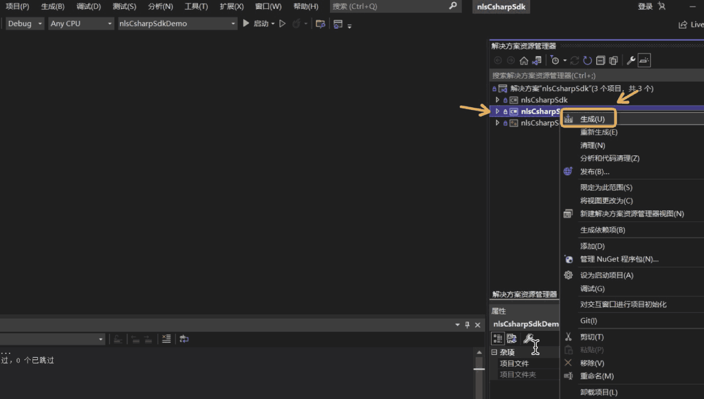

# 阿里智能语音交互

欢迎使用阿里智能语音交互（C++ SDK）。

C++ SDK 提供一句话识别、实时语音识别、语音合成等服务。可应用于客服、法院智能问答等多个场景。  

## 前提条件

在使用 C++ SDK 前，确保您已经：

* 注册了阿里云账号并获取您的Access Key ID 和 Secret。

* 开通智能语音交互服务

* 创建项目

* 获取访问令牌（Access Token)

* Linux下请安装GCC 4.1.2 或以上版本

详细说明请参考:[智能语音交互接入](https://help.aliyun.com/document_detail/72138.html)  

## 如何使用 C++ SDK

接入前请仔细阅读C++ SDK3.0文档：https://help.aliyun.com/product/30413.html

特殊说明：当前版本C++SDK3.1.x，相较于3.0，接口sendAudio有改动，具体请看接口头文件中接口说明。  

### Linux平台编译及说明：
编译指令：  
> ./scripts/build_linux.sh                         默认增量编译，生成Debug版本  
> ./scripts/build_linux.sh all debug        全量编译，生成Debug版本  
> ./scripts/build_linux.sh incr debug     增量编译，生成Debug版本  
> ./scripts/build_linux.sh all release      全量编译，生成Release版本  
> ./scripts/build_linux.sh incr release    增量编译，生成Release版本  

生成物NlsSdk3.X_LINUX 目录说明:  
NlsSdk3.X_LINUX  
│── bin  
│   │── daDemo         对话Demo binary文件  
│   │── srDemo         一句话识别Demo binary文件  
│   │── stDemo         实时识别Demo binary文件  
│   └── syDemo         音频转写Demo binary文件  
│── demo  
│   │── build_linux_demo.sh          一键编译当前Demo  
│   │── dialogAssistantDemo.cpp      对话Demo源码  
│   │── speechRecognizerDemo.cpp     一句话识别Demo源码  
│   │── speechSynthesizerDemo.cpp    音频转写Demo源码  
│   └── speechTranscriberDemo.cpp    实时识别Demo源码  
│   │── resource            测试资源（测试音频文件）  
│   │   └── audio  
│   │       ├── test0.wav  
│   │       ├── test1.wav  
│   │       ├── test2.wav  
│   │       └── test3.wav  
│── include                 接口头文件  
│   │── iNlsRequest.h  
│   │── nlsClient.h  
│   │── nlsEvent.h  
│   │── nlsGlobal.h  
│   │── nlsToken.h  
│   │── dialogAssistantRequest.h  
│   │── speechRecognizerRequest.h  
│   │── speechSynthesizerRequest.h  
│   └── speechTranscriberRequest.h  
│── lib                     库（原libalibabacloud-idst-common.so已合并入libalibabacloud-idst-speech.so）  
│   │── libalibabacloud-idst-speech.a  
│   └── libalibabacloud-idst-speech.so  
│── README.md  
└── version                 版本说明  

注意：
1. linux环境下，运行环境最低要求：Glibc 2.5及以上， Gcc4及以上。   
2. linux环境下，高并发运行，注意 系统打开文件数限制，可通过ulimit -a查看当前允许的打开文件数限制。比如预设最大并发数1000，建议将open files限制设置大于1000，ulimit -n 2000。否则会出现connect failed错误。  

### 嵌入式(eg. arm-linux等)平台编译及说明：  
> 请自行交叉编译... 

### Android平台编译及说明：  
支持arm64-v8a、armeabi、armeabi-v7a、x86、x86_64  
编译指令：  
> ./scripts/build_android.sh                         默认增量编译，生成arm64-v8a架构Debug版本  
> ./scripts/build_android.sh all debug arm64-v8a     全量编译，生成arm64-v8a架构Debug版本  
> ./scripts/build_android.sh incr debug arm64-v8a    增量编译，生成arm64-v8a架构Debug版本  
> ./scripts/build_android.sh all release arm64-v8a   全量编译，生成arm64-v8a架构Release版本  
> ./scripts/build_android.sh incr release arm64-v8a  增量编译，生成arm64-v8a架构Release版本   

### Windows Cpp 平台编译及说明：  
#### 一、简单编译方式（推荐）
此方式使用已经编译好的第三方库进行编译  
> 1. 打开build_windows_64_prebuild.bat和build_windows_64_package.bat，修改解压缩工具WinRAR（set winRar="C:\Program Files (x86)\WinRAR\WinRAR.exe"）为自己电脑WinRAR路径。  
> 1. 运行 build_windows_64_prebuild.bat  
> 此批处理为了解压各第三方库，并把依赖头文件移动到合适位置   
> 3. 使用vs打开nlsCppSdk.sln，直接编译。现支持x64_debug和x64_Release  
>      
>
> 4. 编译出debug_x64和release_x64  
>    Debug生成物路径: {ProjectRoot}\build\build_win64\nlsCppSdk\x64\Debug   
>    Release生成物路径: {ProjectRoot}\build\build_win64\nlsCppSdk\x64\Release   
>    下有所有生成的dll和测试exe.  
>
> 5. 运行build_windows_64_package.bat  
>    将生成物进行打包，生成{ProjectRoot}\build\install\NlsSdk3.X_win64.zip。内部包含所有动态库、测试exe、头文件、说明文档。  

#### 二、自动化编译方式
此方法可能由于vs版本或windows平台差异问题，无法顺利运行  
>  运行 build_windows_64.bat  

### Windows C# 平台编译及说明：  
此方式使用已经编译好的第三方库进行编译
> 1. 必须先完成windows Cpp 平台编译，C#依赖windows cpp sdk。  
> 2. 使用vs打开nlsCsharpSdk.sln，进行c#工程编译  
>   
> 3. {ProjectRoot}\nlsCsharpSdk\nlsCsharpSdkDemo\bin\Debug下生成所有生成物。  
> nlsCsharpSdk.dll  为nls c# sdk，可进行 发布 nupkg。  
> nlsCsharpSdkExtern.dll  为nls c#与cpp互操作层。  
> nlsCsharpSdkDemo.exe 为nls c# UI demo。  
> 4. 运行还需要一些nls cpp sdk相关依赖库，需要搬移到nlsCsharpSdkDemo.exe能依赖的路径{ProjectRoot}\nlsCsharpSdk\nlsCsharpSdkDemo\bin\Debug。   
> {ProjectRoot}\build\install\NlsSdk3.X_win64\lib\14.0\x64\Debug\nlsCppSdk.dll  
> {ProjectRoot}\build\install\NlsSdk3.X_win64\lib\14.0\x64\Debug\libcrypto-1_1-x64.dll  
> {ProjectRoot}\build\install\NlsSdk3.X_win64\lib\14.0\x64\Debug\libssl-1_1-x64.dll  
> {ProjectRoot}\build\install\NlsSdk3.X_win64\lib\14.0\x64\Debug\libcurld.dll (release版为libcurl.dll)  
> {ProjectRoot}\build\install\NlsSdk3.X_win64\lib\14.0\x64\Debug\libeay32.dll  
> {ProjectRoot}\build\install\NlsSdk3.X_win64\lib\14.0\x64\Debug\ssleay32.dll  
> {ProjectRoot}\build\install\NlsSdk3.X_win64\lib\14.0\x64\Debug\pthreadVC2.dll   
> {ProjectRoot}\nlsCsharpSdk\nlsCsharpSdkDemo\bin\Debug\audio_files\test3.wav 需要有一个名叫test3.wav的音频文件用于进行语音识别。  
> 5. nlsCsharpSdkDemo.exe 运行要点  
>   
> a.  &lt;OpenLog&gt; 可开启日志记录（可选)  
> b.  &lt;InitNls&gt; 初始化sdk   
> c.  填入Appkey、AkId、AkSecret，然后&lt;CreateToken&gt;生成token，合法token会在Token栏显示。  
> d.  实时转写&lt;CreateTranscriber&gt;创建实时转写请求，点&lt;Start&gt;开始工作，会在最下方实时显示识别结果。&lt;Stop&gt;&lt;ReleaseTranscriber&gt;进行停止、释放。  
> e.  语音合成&lt;CreateSynthesizer&gt;创建语音合成请求，点&lt;Start&gt;开始工作，会exe当前路径生成保存音频数据的taskId.pcm文件。&lt;Cancel&gt;&lt;ReleaseSynthesizer&gt;进行停止、释放。  
> f.   一句话识别&lt;CreateRecognizer&gt;创建一句话识别请求，点&lt;Start&gt;开始工作，会在最下方显示识别结果。&lt;Stop&gt;&lt;ReleaseRecognizer&gt;进行停止、释放。  
